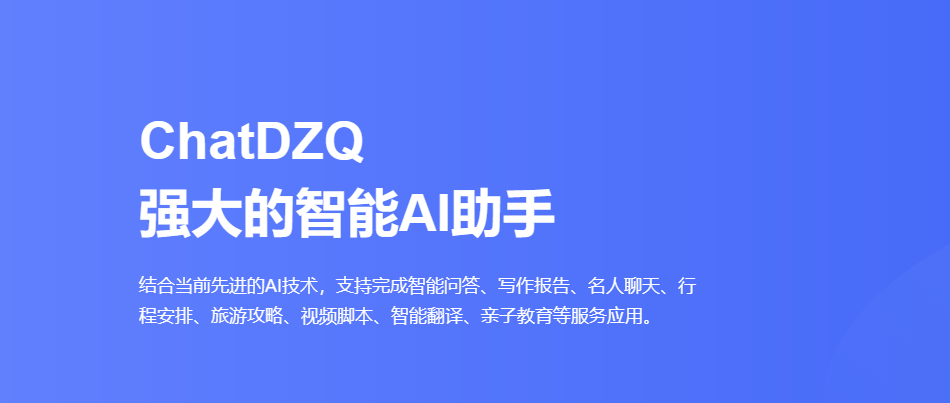

# Chat DZQ

## 目录

- [介绍](#ChatDZQ智能AI助手)
- [本地部署](#robot-本地部署)
  - [硬件要求](#硬件要求)
  - [下载安装](#下载安装)
  - [使用示例](#使用示例)
- [微调](#fire-微调)
  - [软件依赖](#软件依赖)
  - [使用方法](#使用方法)
- [友情链接](#link-友情链接)
- [未来计划](#construction-未来计划)
- [公司地址](#公司地址)

### ChatDZQ智能AI助手

我们基于自身搭建的一整套从业务、数据、算法等协同的SaaS中台系统，通过对GPT微训练模型研究，逐步实现一些具体场景应用。  
1.构建分布式GPT模型，实现了较高的语义理解能力；  
2.实现GPT模型自动对话生成，并取得了出色的实际应用效果；  
3.实现GPT模型的性能优化，提升了模型的泛化能力。  
ChatDZQ是我们旗下一款基于GPT进行API接口开发的自然语言处理软件，能够通过学习和理解人类的语言来进行对话，还会根据聊天的上下文进行互动来与大家进行交流。支持完成写作报告，文字生图、名人聊天、行程安排、旅游攻略、视频脚本、智能翻译、亲子教育等任务应用。
如果您想要感受GPT的强大功能，欢迎体验ChatDZQ，同时我们还将定期为您分享GPT有关的新进展和技术迭代。

# 开源大模型
## Llama 2
[Github地址 Llama2](https://github.com/facebookresearch/llama)  
[官网地址 Llama2](https://ai.meta.com/llama/)

LLaMA(大型语言模型Meta AI)是一个大型语言模型(llm)家族，由Meta AI于2023年2月发布。

第一版LLaMa共训练了7亿个、13亿个、33亿个和650亿个参数。LLaMA的开发人员报告说，13B参数模型在大多数NLP基准测试中的性能超过了更大的GPT-3(具有175B参数)，并且最大的模型与最先进的模型(如PaLM和Chinchilla)具有竞争力。
 -[1]虽然最强大的llm通常只能通过有限的api访问(如果有的话)，但Meta在非商业许可下向研究社区发布了LLaMA的模型权重。
 -[2]在LLaMA发布的一周内，它的权重通过BitTorrent在4chan上向公众泄露
在2023年7月，Meta发布了几个模型，如羊驼2，使用了70,130和700亿个参数。

## MOSS
[Github地址 MOSS](https://github.com/OpenLMLab/MOSS)  
MOSS是一个支持中英双语和多种插件的开源对话语言模型，moss-moon系列模型具有160亿参数，在FP16精度下可在单张A100/A800或两张3090显卡运行，在INT4/8精度下可在单张3090显卡运行。MOSS基座语言模型在约七千亿中英文以及代码单词上预训练得到，后续经过对话指令微调、插件增强学习和人类偏好训练具备多轮对话能力及使用多种插件的能力。

局限性：由于模型参数量较小和自回归生成范式，MOSS仍然可能生成包含事实性错误的误导性回复或包含偏见/歧视的有害内容，请谨慎鉴别和使用MOSS生成的内容，请勿将MOSS生成的有害内容传播至互联网。若产生不良后果，由传播者自负。

## ChatGLM-6B
[Github地址 ChatGLM-6B](https://github.com/THUDM/ChatGLM-6B)  
ChatGLM-6B 是一个开源的、支持中英双语的对话语言模型，基于 General Language Model (GLM) 架构，具有 62 亿参数。结合模型量化技术，用户可以在消费级的显卡上进行本地部署（INT4 量化级别下最低只需 6GB 显存）。 ChatGLM-6B 使用了和 ChatGPT 相似的技术，针对中文问答和对话进行了优化。经过约 1T 标识符的中英双语训练，辅以监督微调、反馈自助、人类反馈强化学习等技术的加持，62 亿参数的 ChatGLM-6B 已经能生成相当符合人类偏好的回答，更多信息请参考我们的博客。欢迎通过 chatglm.cn 体验更大规模的 ChatGLM 模型。

为了方便下游开发者针对自己的应用场景定制模型，我们同时实现了基于 P-Tuning v2 的高效参数微调方法 (使用指南) ，INT4 量化级别下最低只需 7GB 显存即可启动微调。

ChatGLM-6B 权重对学术研究完全开放，在填写问卷进行登记后亦允许免费商业使用。

## Baichuan-7B
[Github地址 Baichuan-7B](https://github.com/baichuan-inc/Baichuan-7B)  
Baichuan-7B 是由百川智能开发的一个开源可商用的大规模预训练语言模型。基于 Transformer 结构，在大约 1.2 万亿 tokens 上训练的 70 亿参数模型，支持中英双语，上下文窗口长度为 4096。在标准的中文和英文 benchmark（C-Eval/MMLU）上均取得同尺寸最好的效果。

### 公司地址

##### 中国·厦门
厦门市思明区厦禾路189号银行中心805室

##### 联系电话
400-8856-200